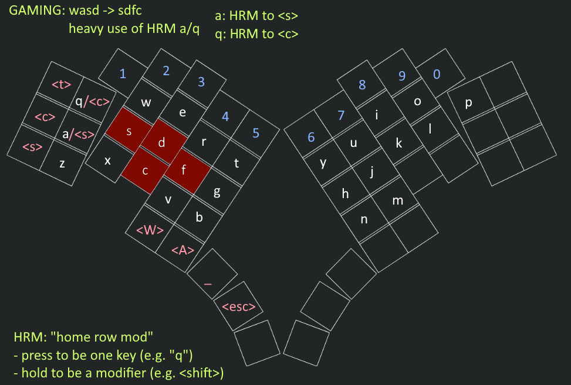

# Blackbird

A low profile, choc-spaced, monoblock split, sexy keyboard

## Design

## Materials / Cost

Reuseable (\~$110): MCU, switches, caps, battery

Sunk cost (\~$40): PCB, small components, hotswap sockets

Not sure (<$10): MCU pins / sockets

## References

- [Ergogen tutorial (6 goated pages)](https://flatfootfox.com/ergogen-introduction/)
- Documentation and helpful
[build guide](https://github.com/SlightHeadache/choctopus44/blob/master/documents/buildguide.md):
[choctopus44](https://github.com/SlightHeadache/choctopus44/tree/master)
- Layout: [Absolem](https://github.com/mrzealot/absolem/tree/master)
    - [Blog by author](https://zealot.hu/absolem/)
- Aesthetics: [SP56](https://github.com/ericrlau/SP56)
